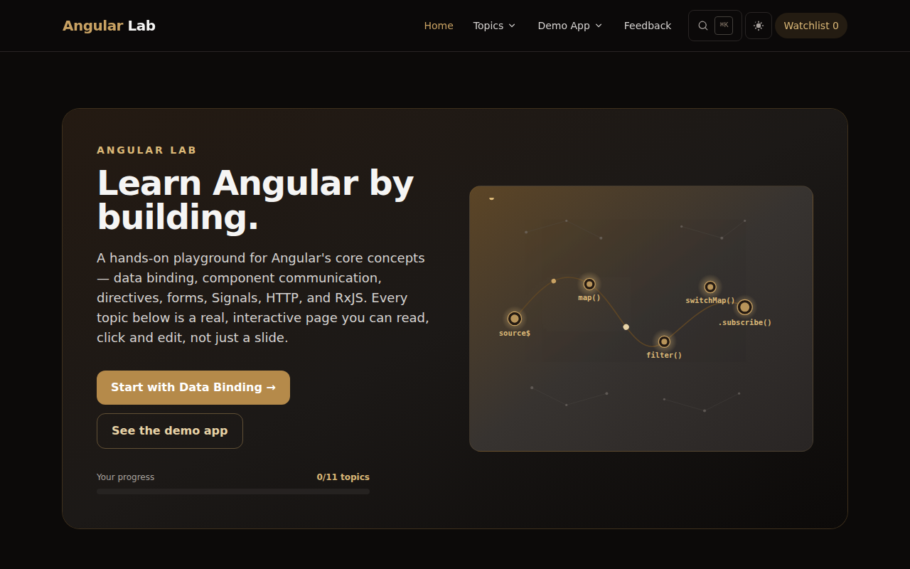
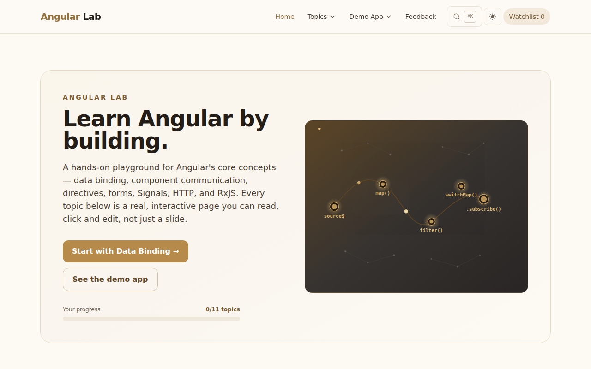
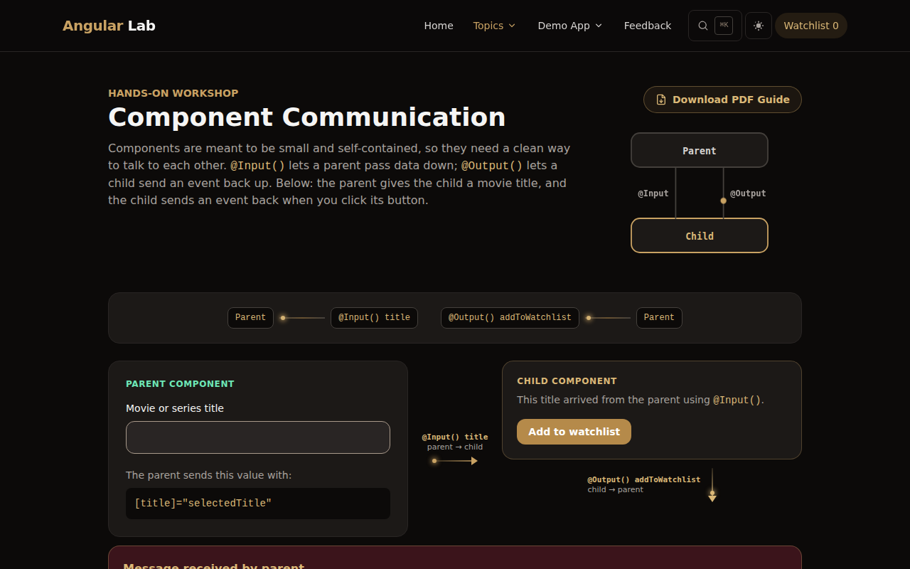
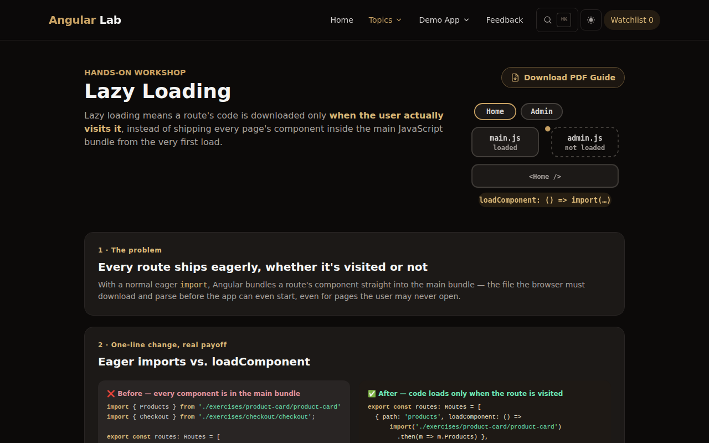

<div align="center">

# Angular Lab

**A hands-on playground for learning Angular — every core concept as a live, interactive page, not a slide.**

[**Live demo →**](https://youssefezzat17.github.io/angular-lab/)


[](https://github.com/YoussefEzzat17/angular-lab/actions/workflows/deploy-github-pages.yml)




</div>

---

## Overview

Angular Lab teaches Angular through **11 lesson pages**. Each one explains *why* a concept exists and what problem it solves, shows a small animated diagram of what is actually happening, and gives you a live example you can click, edit and watch update in the browser. A small movie-and-series **demo app** shows several of these concepts working together in one real feature.

It is built with modern Angular only: standalone components, signals, the `@if` / `@for` / `@switch` control flow and signal inputs — no NgModules. There is no backend; everything runs in the browser.

## Features

- **11 interactive lessons** with an animated diagram beside each topic's intro, a recap quiz and next/previous navigation.
- **Progress tracking** — pages you visit are remembered, and a "Mark as complete" button drives the progress bar on the home page. Saved in `localStorage`.
- **Light and dark themes** built on CSS variables, so every colour follows the theme (toggle in the navbar; respects the system preference).
- **Command palette** — press <kbd>⌘</kbd>/<kbd>Ctrl</kbd> + <kbd>K</kbd> to jump to any topic.
- **Downloadable PDF guides** for each lesson, from the "Download PDF Guide" button.
- **Demo app** — browse titles, keep a persistent **Watchlist** (with duplicate detection and a remove / clear-all page) and a **My List** of favourites; both survive a refresh.
- **Toast notifications** with success / error / info styles, a countdown bar and pause-on-hover.
- **Feedback form** that sends a real email through [EmailJS](https://www.emailjs.com/) (client-side, public key only).
- **Accessible and responsive** — keyboard navigable, `prefers-reduced-motion` respected, works down to phone width.

<div align="center">


</div>

## Lessons

The order below is the recommended learning path.

| # | Topic | Route | What you learn |
| - | --- | --- | --- |
| 1 | Data Binding | `/binding` | Interpolation, property, event and two-way binding |
| 2 | Pipes | `/pipes` | Formatting dates, prices and text in templates, plus a custom pipe |
| 3 | Directives | `/directives` | `*ngIf`, `*ngFor` and custom attribute directives |
| 4 | Angular Forms | `/forms` | Template-driven vs. reactive forms, validation |
| 5 | Component Communication | `/communication` | `@Input()` / `@Output()`, parent ↔ child with animated data-flow arrows |
| 6 | Routing | `/routing` | Routes, `router-outlet`, `routerLink`, route parameters |
| 7 | Signals | `/signals` | `signal()`, `computed()`, `effect()` |
| 8 | Fetch API & HTTP | `/movies` | `HttpClient`, services, a real public API |
| 9 | RxJS | `/rxjs` | Observables, operators (`map`, `filter`, `switchMap`, `debounceTime`), memory leaks, the `async` pipe |
| 10 | Lazy Loading | `/lazy-loading` | `loadComponent` and smaller initial bundles |
| 11 | HttpInterceptor | `/interceptor` | One checkpoint for every request and response (e.g. attaching a token) |

**Demo app:** `/products` (browse titles) · `/products/:id` (details) · `/watchlist` · `/favorites`. **Also:** `/feedback`.

## Tech stack

| | |
| --- | --- |
| Framework | Angular 20 — standalone components, signals, signal inputs, new control flow |
| Language | TypeScript 5.8 |
| Styling | Tailwind CSS 3 with CSS-variable design tokens (light / dark) |
| Reactive | RxJS 7.8 and Angular Signals |
| Email | `@emailjs/browser` |
| Testing | Jasmine + Karma |
| Hosting | GitHub Pages, deployed by GitHub Actions |

## Getting started

**Requirements:** Node.js 22+ and npm.

```bash
git clone https://github.com/YoussefEzzat17/angular-lab.git
cd angular-lab
npm install
npm start          # http://localhost:4200
```

The app reloads on every save — change a component and watch the concept it teaches update live.

| Command | What it does |
| --- | --- |
| `npm start` | Dev server on `http://localhost:4200` |
| `npm run build` | Production build into `dist/angular-lab/` |
| `npm test` | Unit tests (Karma + Jasmine) |
| `npm run build:gh-pages` | Production build plus the `404.html` / `.nojekyll` files GitHub Pages needs |

### Feedback form (optional)

The feedback page sends mail through EmailJS. Its service ID, template ID and **public** key live in `src/app/core/services/feedback.service.ts`. To use your own account, replace those three values. Never put a private key in client code.

## Project structure

```text
src/app/
├── core/
│   ├── data/          topics.ts — single source of truth for every lesson
│   ├── layout/        navbar, footer, toast, command palette
│   ├── models/        Movie, Product, User
│   └── services/      progress, theme, toast, watchlist (cart), favorites,
│                      feedback, movie, product, search palette, safe-storage
├── pages/             one folder per lesson, plus the demo pages
│                      (home, products, product-details, watchlist, favorites, feedback)
├── shared/            reusable UI: page-header, lesson-card, recap, topic-nav,
│                      topic-illustration, flow-arrow, flow-diagram, icon,
│                      download-pdf-button, code-block directive
├── directives/        custom attribute directives used in the lessons
└── pipes/             custom pipes used in the lessons
public/pdfs/           downloadable PDF guide for each lesson
docs/                  workshop blueprint and slide deck, README screenshots
```

A few design decisions worth knowing:

- **One list of topics.** `core/data/topics.ts` drives the navbar, the command palette, the home page and progress tracking. Adding a lesson means adding one entry there plus a route.
- **Theme tokens, not hard-coded colours.** Colours are CSS variables defined in `src/styles.css` and mapped into Tailwind, so light and dark share the same classes.
- **Safe persistence.** Watchlist, favourites and progress go through `safe-storage.ts`, which never throws if storage is blocked or the saved JSON is corrupt.

## Deployment

Every push to `main` runs `.github/workflows/deploy-github-pages.yml`: it installs dependencies, builds with the production configuration (base href `/angular-lab/`) and publishes to GitHub Pages. A copy of `index.html` is saved as `404.html` so deep links such as `/angular-lab/signals` still resolve to the single-page app.

## Contributing

1. Create a branch from `main`.
2. Make your change and run `npm test` and `npm run build`.
3. Open a pull request describing what changed and why.

## Author

Built by **Youssef Ezzat** — [@YoussefEzzat17](https://github.com/YoussefEzzat17).

## Resources

- [Angular documentation](https://angular.dev)
- [Angular CLI reference](https://angular.dev/tools/cli)
- [Tailwind CSS](https://tailwindcss.com/docs)
- [RxJS](https://rxjs.dev)
